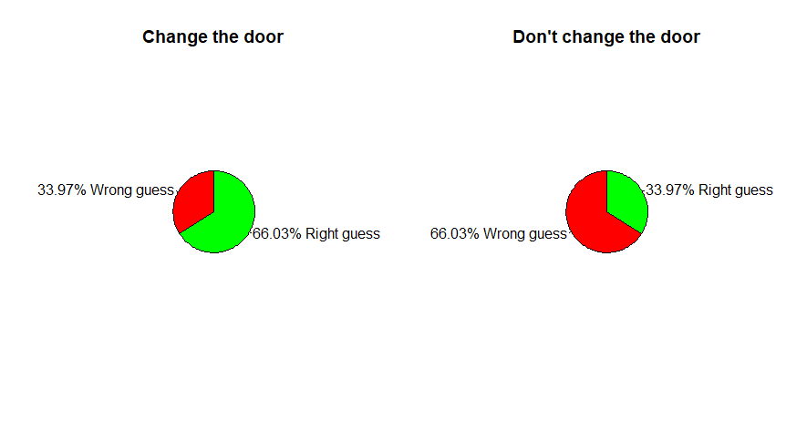

# Data-analysis-in-Astronomy
Set of exercises and activities done in this discipline offered by IAG-USP

## Probabilities and Statistics
In this first section, two statical problems are presented: **The Monty Hall problem** and **The Prisioner Dillemma**. Both of them consist in guessing in which of some options (3 or 4 in these cases) there is a prize. After choosing, it is revealed one of the incorrect options and it given the possibility of changing the previous guess and choosing any of the remaining options. This programs give the statistical answer if changing the guess is a better option or not

### The Monty Hall problem
Three doors are presented to a contestant, behind two of them there is a goat and behind the othe one there's a car. After making a guess, one of the doors that has a goat is opened and it is asked if the contestant wants to switch the door option.

Statistically, there is a benefit if the door is changed, because taking this action would be like betting the choice is wrong, what has a higher probability. 

  

### The Prisioner Dillemma
Similarly to the privious case, now four doors are presented to a prisioner, behind three of them there is a cliff, meaning he will die, and behind the other one there is a field, meaning he will be free. One door is opened and the change offer is done, and once again, due to the same arguments, the best option is to try another door option.

  

## Simulation with random numbers
In this section, three simulations were done with random numbers: **Bootstrap**, **Monte Carlo for determination of Pi** and **Monte Carlo for integration**.

### Bootstrap Simulation
From a uniform distribution that behaves as a straigh line a bootstrap simulation will be applied to determine the parameters for the best fit of this line.

  
  

### Monte Carlo Simulation - Determination of Pi
Let's consider a square with side equals to 1 and a quarter of circle with radius also equal to 1. If random points inside of the square are obtained, the ratio between the ones that are also inside the quarter of circle and the total of points will be very close to the ratio between the quarter area and the square area. Therefore, it will be possible to determine the value of Pi. 

The greater the amount of random points the closer the estimation of the value will be

|        | Value   | Difference|
|:-----------|:-----------:|-----------:|
|True value | 3.141592 | 0.000000 |
|N = 10| 2.800000| 0.341592|
|N = 100| 3.120000| 0.021592|
|N = 1000| 3.088000| 0.053592|
|N = 10000| 3.139200| 0.002392|
|N = 100000| 3.134720| 0.006872|

### Monte Carlo Simulation - Function Integration
Similarly to the previous example, assuming a function inside of a figure with known, once random points are got from this figure, by making the same comparison as before it's possible to determine the area of this function. In this example, a *sin(x)* function was "integrated" from 0 to pi, which it's known beforehand that the result is 2.

  

## Probability Distributions
In this section, some common probability distributions where simulated: **gaussian distribution**, **binomial distribution**, **exponential distribution** and **Poisson distribution**.

### Gaussian Distribution
- A type of continuous probability distribution for a random variable

  

### Binomial Distribution
- Distribution that count **n** amount  of attempts from a total **N** with same probability **p**.

  

### Exponential Distribution
- Distribution that describes a process in which events occur continuously and independently at a constant average rate, such as the decay process of a nuclear element.

  

### Poisson Distribution
- Probability of **n** events to occur in a certain time gap or a certain region of space

  

## Final Course Project - Support Vector Machines for classification
The latest topics of this discipline were some topics about machine learning. Regarding to gain practice in this subject, the Final Course Project chosen was the analysis of the minimum amount of features in the classification of a sample of the S-PLUS (Southern Photometric Local Universe Survey) that would return an accuracy greater than 95%, using a Support Vector Machine algorithm.

The data consisted on photometric information of stars, galaxies and quasars. The features presented were:
- ID: object identification
- MU MAX: maximum superficial brightness
- KRON RADIUS: object size measurement in pixels
- ISO AREA: number of pixels of the object over certain amount 
- FWHM_n: Full Width at Half Maximum (normalized)
- u petro ... z petro: magnitudes in the 12 optical bands of the S-PLUS
- z: redshift

The behavior of each object according to some of magnitudes, to the KRON RADIUS and to the MU MAX were studied, respectively, as shown next:

  

  

  

After combining different features in different quantities, it was concluded that the association of **MU MAX** with any other magnitude feature was enough to reach an accuracy higher than the one expected. It's important to reforce that this is an unique case in which a few amount of features well classificates all the objects studied. The usage of any other features different from **MU MAX** can also result in a significant accuracy, although it will be necessary more than only two parameters.
